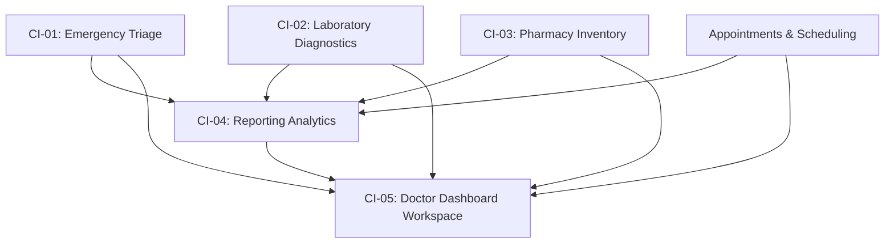

# CityCare Hospital — Configuration Items (CI) Architecture Specification

This document details the modular software architecture of CityCare Hospital.
CityCare is designed to be tracked and managed by the **MedRelease** Software Configuration Management (SCM) platform. Each service described below operates as an independent Configuration Item with defined interfaces, dependencies, and boundary contracts.

---

## Architecture Overview & Dependency Graph

- **CI-01 (Emergency)**: Standalone module. Ingests public tickets, manages clinical triage priority queue.
- **CI-02 (Laboratory)**: Standalone module. Manages test catalog, physician diagnostic orders, sample collection timestamps, and abnormal flagging.
- **CI-03 (Pharmacy)**: Standalone module. Manages medicine formulary, stock adjustments, prescription fulfillment, and patient refill approvals.
- **CI-04 (Reporting)**: Downstream consumer of CI-01, CI-02, CI-03, and Appointments. Aggregates data and delivers role-scoped analytics and CSV exports.
- **CI-05 (Doctor Dashboard)**: Unified aggregation layer consuming all CIs into a single, high-efficiency physician workspace.

---

## CI-01: Emergency Triage

- **CI Identifier**: `CI-EMERGENCY-001`
- **Scope**: Public walk-in/intake registration, emergency hotline routing, and live priority queuing.
- **Data Models**: `EmergencyRequest` (`app/models/emergency.py`)
  - Indexes: `(status, created_at)`
  - Statuses: `WAITING`, `IN_TREATMENT`, `RESOLVED`, `DISCHARGED`
  - Severity: `CRITICAL` (P1), `HIGH` (P2), `MEDIUM` (P3), `LOW` (P4)
- **API Endpoints**:
  - `POST /emergency` (Public) — Create intake ticket
  - `GET /emergency/queue` (Clinical: DOCTOR, ADMIN) — Live sorted queue by urgency
  - `PUT /emergency/{id}/triage` (Clinical: DOCTOR, ADMIN) — Update status, acuity, and clinical notes

---

## CI-02: Laboratory Diagnostics

- **CI Identifier**: `CI-LABORATORY-002`
- **Scope**: Diagnostic test catalog, physician order entry, pathology sample tracking, and result delivery.
- **Data Models**: `LabTest`, `LabOrder` (`app/models/laboratory.py`)
  - Statuses: `ORDERED` &rarr; `SAMPLE_COLLECTED` &rarr; `RESULT_READY`
  - Abnormal Flag: `is_abnormal` boolean with high-visibility UI indicator
  - Isolation: Strict patient isolation (Cross-patient access returns `403 Forbidden`)
- **API Endpoints**:
  - `GET /laboratory/tests` (Public / Authenticated) — Test formulary
  - `POST /laboratory/orders` (DOCTOR only) — Order diagnostic lab test
  - `GET /laboratory/orders/my` (PATIENT) — View personal lab results
  - `GET /laboratory/orders` (Clinical: DOCTOR, ADMIN) — View all orders
  - `PUT /laboratory/orders/{id}/collect-sample` (Clinical: DOCTOR, ADMIN)
  - `PUT /laboratory/orders/{id}/result` (Clinical: DOCTOR, ADMIN)

---

## CI-03: Pharmacy & Dispensary

- **CI Identifier**: `CI-PHARMACY-003`
- **Scope**: Medicine inventory tracking, reorder threshold alerts, multi-item digital prescriptions, and refill requests.
- **Data Models**: `Medicine`, `Prescription`, `PrescriptionItem`, `RefillRequest` (`app/models/pharmacy.py`)
  - Automatic deduction: Stock automatically deducted when prescriptions are issued
  - Reorder trigger: `stock_quantity <= reorder_level`
  - Isolation: Patient prescription isolation enforced via 403 checks
- **API Endpoints**:
  - `GET /pharmacy/medicines` — Formulary list
  - `GET /pharmacy/medicines/low-stock` — Low-stock threshold filter
  - `POST /pharmacy/medicines` (ADMIN) — Add medication
  - `PUT /pharmacy/medicines/{id}/stock` (ADMIN) — Adjust stock delta
  - `POST /pharmacy/prescriptions` (DOCTOR) — Issue multi-item prescription
  - `GET /pharmacy/prescriptions/my` (PATIENT) — Personal active prescriptions
  - `GET /pharmacy/prescriptions` (Clinical) — All prescriptions
  - `POST /pharmacy/prescriptions/{id}/refill` (PATIENT) — Request refill
  - `GET /pharmacy/refills` (ADMIN, DOCTOR) — All refill requests
  - `PUT /pharmacy/refills/{id}` (ADMIN, DOCTOR) — Approve / Reject refill

---

## CI-04: Cross-Module Reporting Engine

- **CI Identifier**: `CI-REPORTING-004`
- **Scope**: Cross-CI analytical aggregation, clinical KPIs, low-stock alerts, and automated CSV generation.
- **Data Dependencies**: Reads from `appointments`, `emergency_requests`, `lab_orders`, `medicines`, `prescription_items`.
- **Role Scoping**:
  - `DOCTOR`: Scoped strictly to the physician's own consultations, emergency encounters, and lab orders.
  - `ADMIN`: Aggregated hospital-wide across all physicians and departments.
- **API Endpoints**:
  - `GET /reporting` — Aggregated metrics JSON
  - `GET /reporting/export-csv?type={appointments|emergency|laboratory|pharmacy}` — Dynamic CSV file download

---

## CI-05: Doctor Dashboard Workspace

- **CI Identifier**: `CI-DOCTOR-DASHBOARD-005`
- **Scope**: Unified single-page clinical workstation for attending physicians.
- **Aggregation**:
  - Today's appointment schedule with one-click status updates (`COMPLETED`, `NO_SHOW`)
  - Live emergency department priority queue
  - Pending diagnostic laboratory orders
  - Recent prescriptions issued by the doctor
- **API Endpoints**:
  - `GET /doctor/dashboard` (DOCTOR only) — Consolidated workspace payload

---

## MedRelease SCM Integration Notes
Each CI can be tagged, versioned, and rolled out independently. The API contract between CI-04/CI-05 and the underlying domain CIs uses strict Pydantic schemas, ensuring backward compatibility across platform releases.
